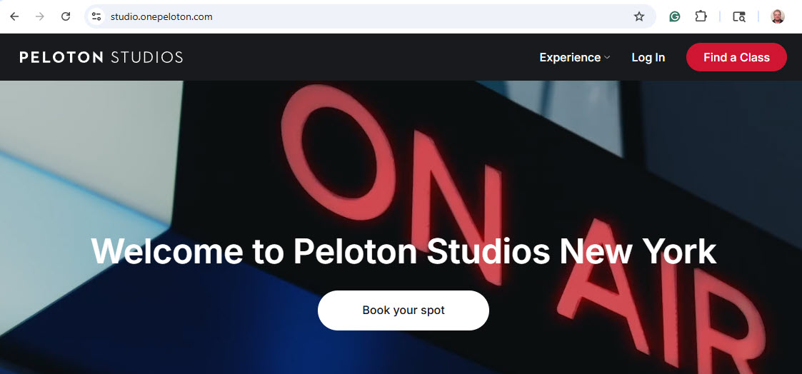
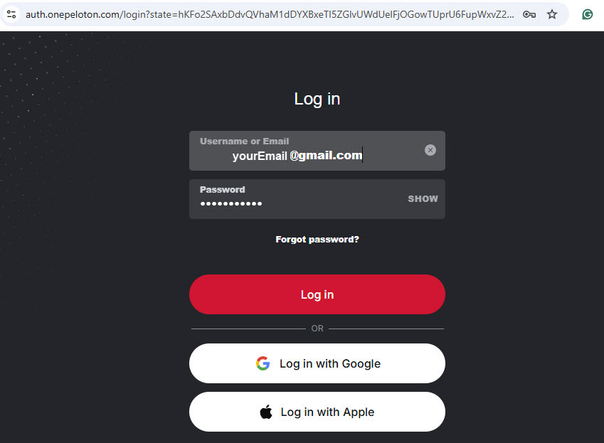
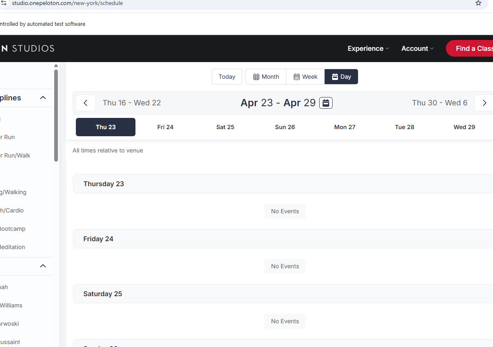
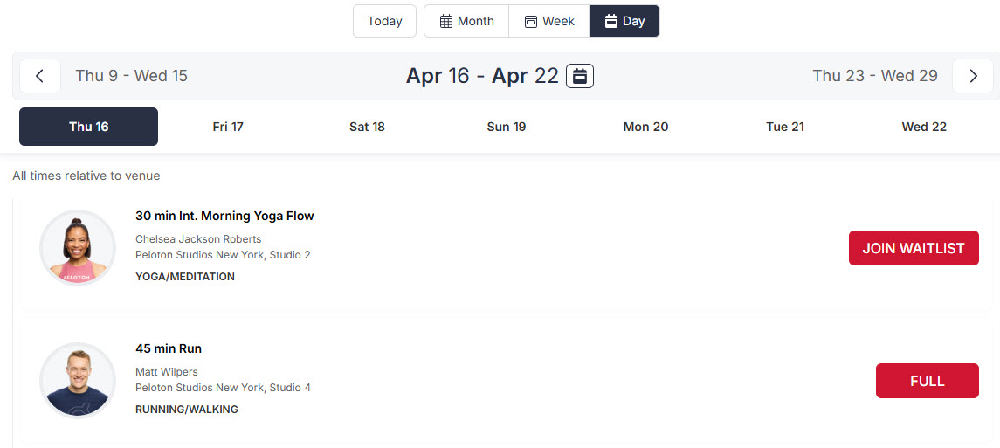
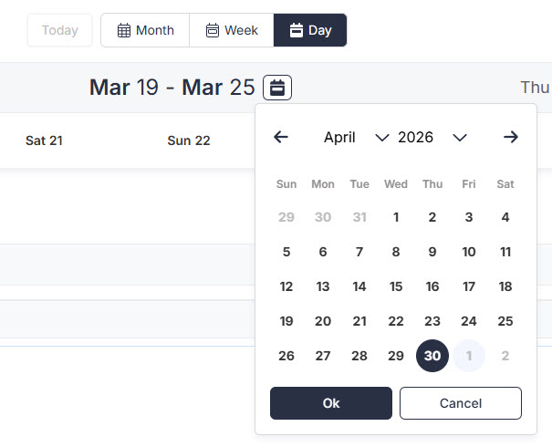
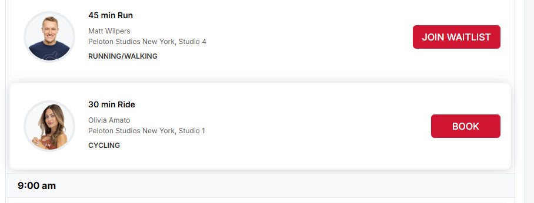
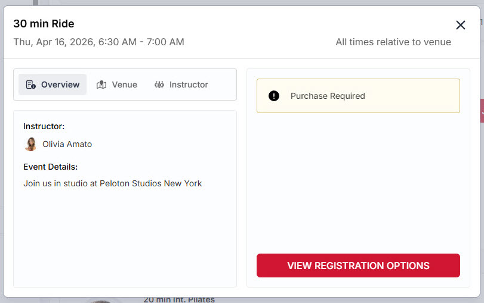
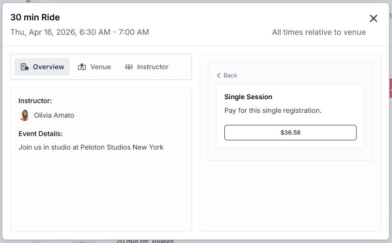
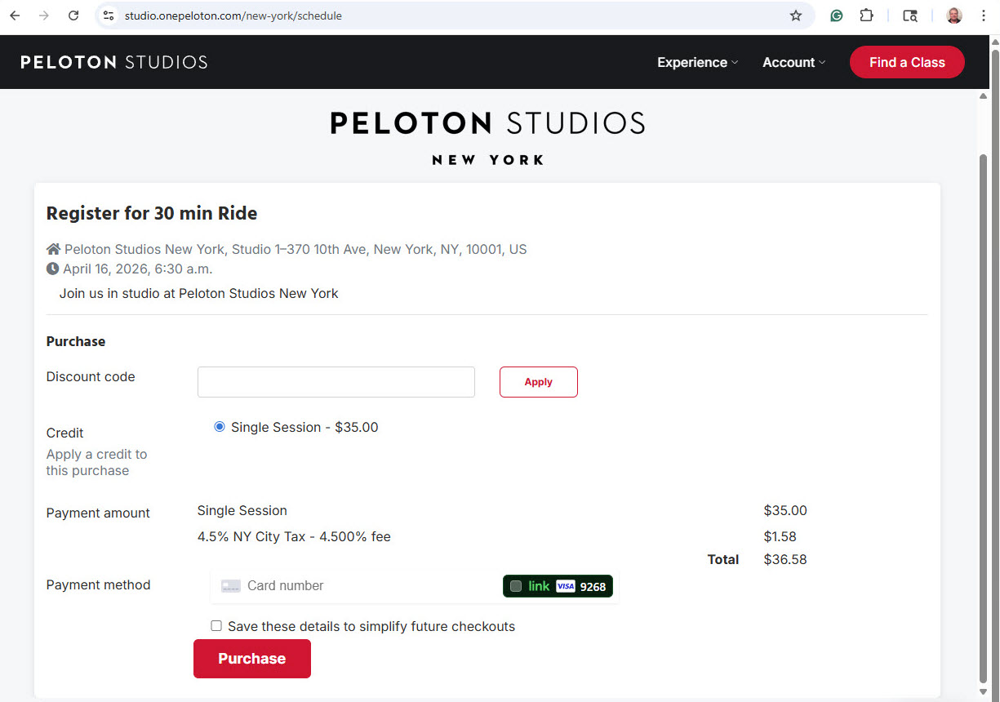
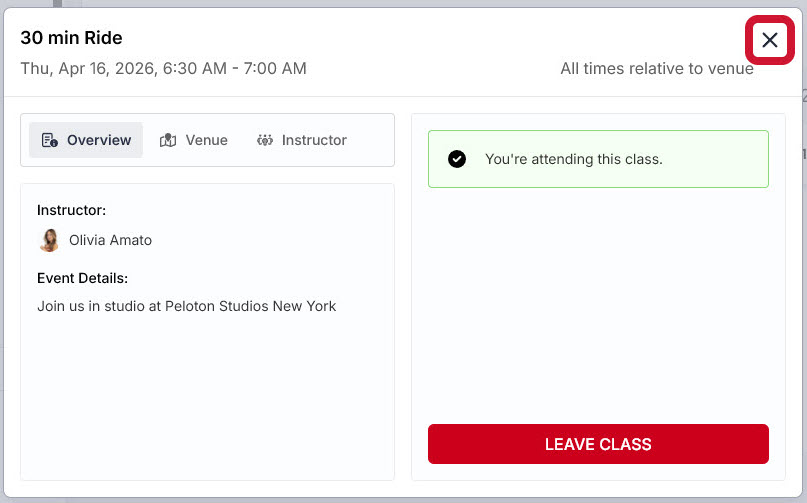

# PeloTRON

This code uses Selenium to drive the web browser and sign you up for an in-person class at Peloton Studios.

TODO more description here. why needed

## Instructions

TODO cred file, command line, restart if crash, configuring desired class

## The Peloton Website

https://studio.onepeloton.com/

TODO talk through

